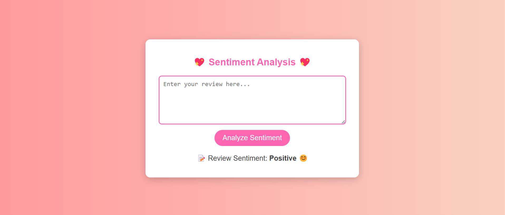

Sentiment Analysis App
About the Project
This is a Sentiment Analysis Web App that predicts the sentiment of Amazon reviews using Machine Learning. The frontend has a beautiful UI with soft pinks & purples, rounded elements, and smooth styling for a better user experience.

Features
Theme – Soft pinks & purples, stylish fonts.

Interactive UI – Hover effects, rounded elements, and smooth animations.

Machine Learning – Uses Natural Language Processing (NLP) to predict sentiments.

Flask Backend – Handles request processing and sentiment predictions.

How to Run the Project
1. Install Dependencies
First, make sure you have Python installed, then install the required libraries:

pip install -r requirements.txt
2. Run the Flask Application
Start the Flask server:

python app.py
It will be available at: http://127.0.0.1:5000

Project Structure

📁 SentimentAnalysis
│── 📂 data               # Amazon reviews dataset
│── 📂 models             # ML Model, vectorizer, and processing scripts
│   │── predict.py        # Prediction logic
│   │── preprocess.py     # Data preprocessing
│   │── sentiment_model.pkl # Trained sentiment classifier
│   │── tfidf_vectorizer.pkl # TF-IDF vectorizer
│   │── train_model.py    # Training script
│── 📂 templates          # HTML Templates
│   │── index.html        # Main frontend page
│── app.py                # Flask backend
│── requirements.txt      # Dependencies
│── README.md             # Project documentation

How it Works
User enters a review on the website.

ML Model predicts sentiment (Positive, Neutral or Negative).

Results are displayed with a well-styled UI.

Screenshots

Contributing
Feel free to contribute by improving the UI, optimizing the model, or adding more features!

Developed with Love
By Charmi Gaddale

